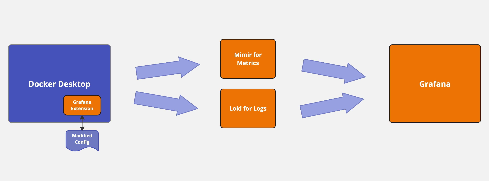
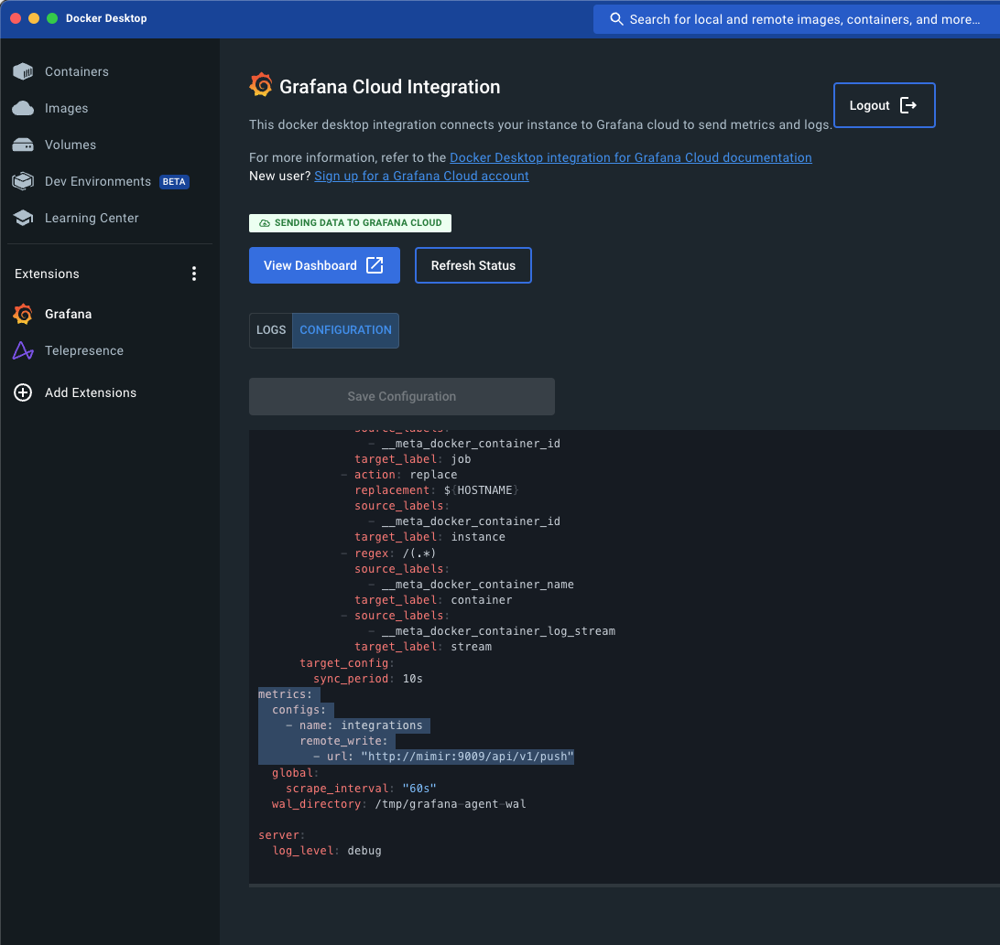
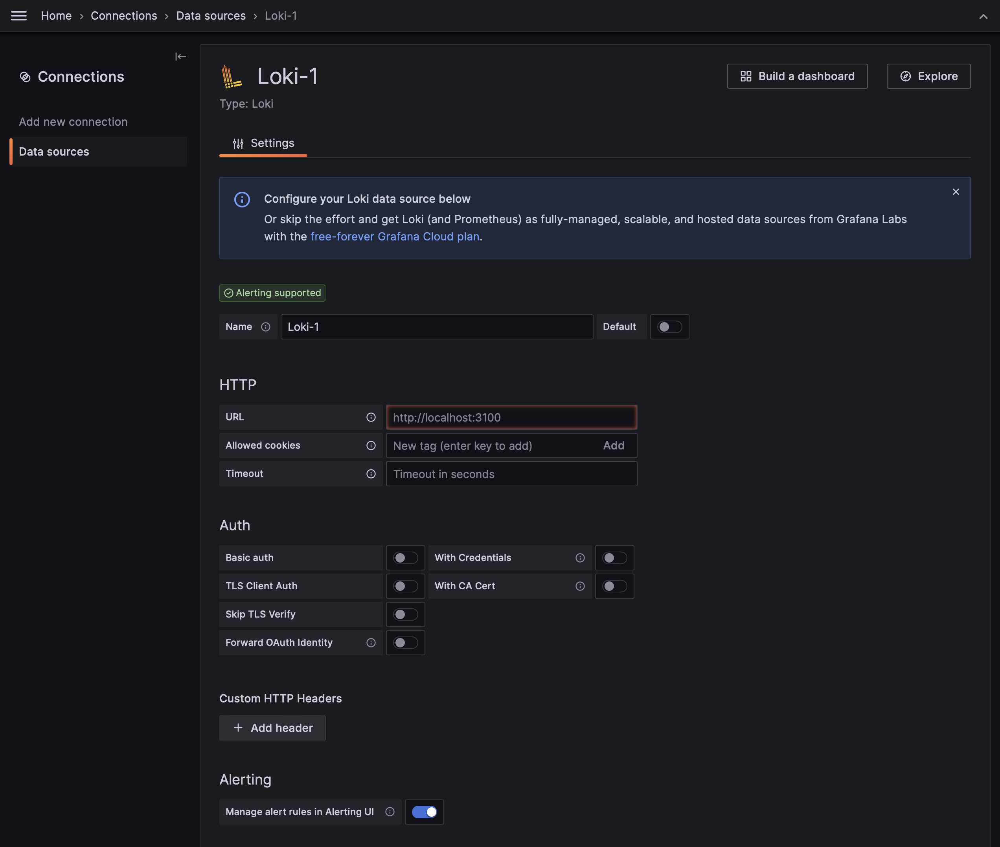
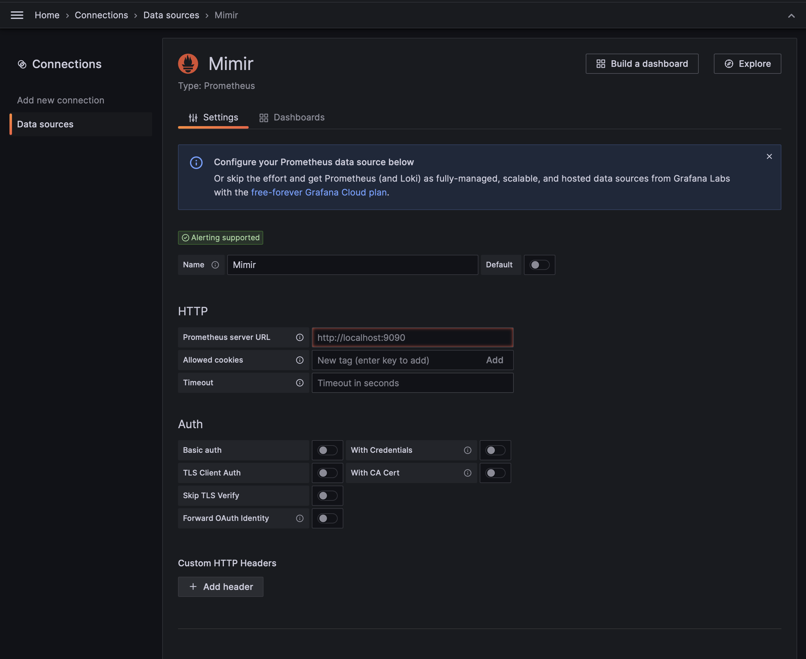
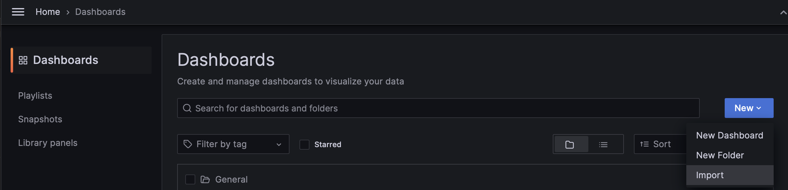
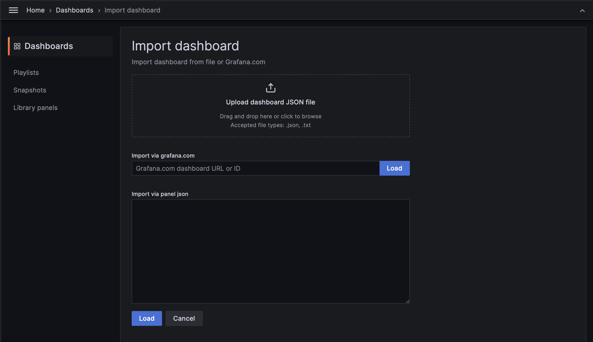

# Next Steps

******

### **Disclaimer: The following is not created, maintained, or endorsed by Docker. It is a reference guide to show a known and tested path for monitoring Docker Desktop in a production appropriate way**

******

If you've setup all-in-one monitoring for test purposes and want to move on to a production ready architecture like below



then you can follow these steps with any [prometheus remote write compatible software](https://prometheus.io/docs/operating/integrations/#remote-endpoints-and-storage) and a log collection endpoint or use the suggested configurate to match the all-in-one deployment.

## Step 1: [Install Loki](https://grafana.com/docs/loki/latest/installation/) via one of the following options to a dedicated location

* [Using Tanka](https://grafana.com/docs/loki/latest/installation/tanka/)
* [Using Helm](https://grafana.com/docs/loki/latest/installation/helm/)
* [Using Docker/Docker Compose](https://grafana.com/docs/loki/latest/installation/docker/)
* [Using Downloadable Binary](https://grafana.com/docs/loki/latest/installation/local/)
* [Using Source Code](https://grafana.com/docs/loki/latest/installation/install-from-source/)

## Step 2: [Install Mimir](https://grafana.com/docs/mimir/latest/operators-guide/) via one of the following options to a dedicated location

* [Monolithic Mode](https://grafana.com/docs/mimir/latest/references/architecture/deployment-modes/#monolithic-mode)
    * [Using Docker](https://grafana.com/docs/mimir/latest/get-started/#download-grafana-mimir)
* [Microservices Mode](https://grafana.com/docs/mimir/latest/references/architecture/deployment-modes/#microservices-mode)
    * [Using Kubernetes](https://grafana.com/docs/mimir/latest/operators-guide/deploy-grafana-mimir/)
    * [Using Puppet](https://grafana.com/docs/mimir/latest/operators-guide/deploy-grafana-mimir-with-puppet/)

## Step 3: Update Docker Desktop Grafana Extension to point at your newly installed Loki and Mimir




### Configuration sections that will need updating:

* ### [node_exporter Section](https://grafana.com/docs/agent/latest/static/configuration/integrations/node-exporter-config/#node_exporter_config)
```
...
    node_exporter:
    enabled: true
    relabel_configs:
      - replacement: ${HOSTNAME}
        target_label: instance
  prometheus_remote_write:
    - basic_auth:
        password: "<Password>"
        username: "<UserName>"
      url: "http://SomeIPAddressOrDNSNameForMimir:9009/api/v1/push"      
```
* ### [Logs Section](https://grafana.com/docs/agent/latest/static/configuration/logs-config/#logs_config)
```
logs:
  configs:
    - clients:
        - basic_auth:
            password: "<Password>"
            username: "<UserName>"
          url: "http://SomeIpAddressOrDNSNameForLoki:3100/loki/api/v1/push"
...
```
* ### [Metrics Section](https://grafana.com/docs/agent/latest/static/configuration/metrics-config/#metrics_config)
```
...
metrics:
  configs:
    - name: integrations
      remote_write:
       - basic_auth:
            password: "<Password>"
            username: "<UserName>"
         url: "http://SomeIPAddressOrDNSNameForMimir:9009/api/v1/push"
...
```

* Refer to the [Metrics Section Configuration Documentation]() for more metrics configuration options.

* Refer to the [Logs Section Configuration Documentation](https://grafana.com/docs/agent/latest/static/configuration/metrics-config/#metrics_config) for more logs configuration options.

## Step 4: [Install Grafana](https://grafana.com/docs/grafana/latest/setup-grafana/installation/) to a dedicated location

## Step 5: Point Grafana at Loki and Mimir

* ### Add Loki Connection


* ### Add Mimir (Prometheus) Connection


## Step 6: Import Dashboards into Grafana

* ### [Overview Dashboard](./grafana/dashboards/Docker%20Desktop%20-%20Docker%20Overview-1688067349005.json)
* ### [Node Dashboard](./grafana/dashboards/Docker%20Desktop%20-%20Node%20Exporter%20_%20Nodes-1688067322859.json)
* ### [Logs Dashboard](./grafana/dashboards/Docker%20Desktop%20-%20Docker%20Logs-1688083087817.json)




