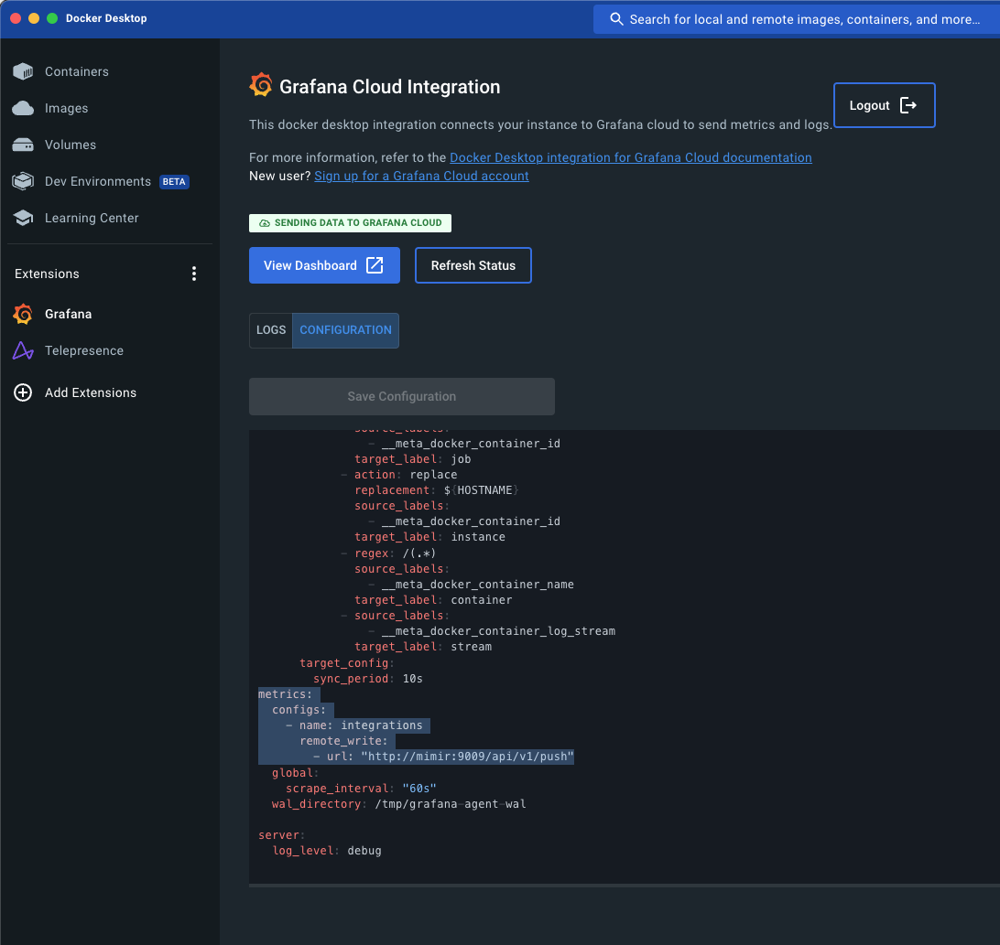

# docker-desktop-monitoring-hello-world
A way to test out end to end Docker Desktop monitoring all in one spot

# Installation

## Step 1: Install the extension
```
docker extension install -f grafana/docker-desktop-extension:0.0.3
```

## Step 2: Install Grafana, Mimir, and Loki
```
docker compose up
```

## Step 3: Enter connection variables as shown below

### Paste these

```
CLOUD_URL="http://localhost:3000" CLOUD_HOSTED_METRICS_URL="http://mimir:9009/api/v1/push" CLOUD_HOSTED_METRICS_ID="1" CLOUD_SCRAPE_INTERVAL="60s" CLOUD_HOSTED_LOGS_URL="http://loki:3100/loki/api/v1/push" CLOUD_HOSTED_LOGS_ID="1" CLOUD_RW_API_KEY=""
```


## Step 4: Open the extensions configuration file

 

## Step 5: Edit the extensions configuration file to look like the following and save

```
integrations:
  agent:
    enabled: true
    relabel_configs:
      - action: replace
        source_labels:
          - agent_hostname
        target_label: instance
  cadvisor:
    docker_only: true
    enabled: true
    instance: ${HOSTNAME}
    relabel_configs:
      - action: replace
        replacement: integrations/docker-desktop
        target_label: job
  node_exporter:
    enabled: true
    relabel_configs:
      - replacement: ${HOSTNAME}
        target_label: instance
  prometheus_remote_write:
    - url: "http://mimir:9009/api/v1/push"      
logs:
  configs:
    - clients:
        - url: "http://loki:3100/loki/api/v1/push"
      name: integrations
      positions:
        filename: /tmp/positions.yaml
      scrape_configs:
        - docker_sd_configs:
            - host: unix:///var/run/docker.sock
              refresh_interval: 5s
          job_name: integrations/docker-desktop
          relabel_configs:
            - action: replace
              replacement: integrations/docker-desktop
              source_labels:
                - __meta_docker_container_id
              target_label: job
            - action: replace
              replacement: ${HOSTNAME}
              source_labels:
                - __meta_docker_container_id
              target_label: instance
            - regex: /(.*)
              source_labels:
                - __meta_docker_container_name
              target_label: container
            - source_labels:
                - __meta_docker_container_log_stream
              target_label: stream
      target_config:
        sync_period: 10s
metrics:
  configs:
    - name: integrations
      remote_write:
        - url: "http://mimir:9009/api/v1/push"
  global:
    scrape_interval: "60s"
  wal_directory: /tmp/grafana-agent-wal

server:
  log_level: debug

```

# Navigate to the overview dashboard

http://localhost:3000/d/docker-desktop-integration-docker/docker-desktop-docker-overview?orgId=1&refresh=30s

 